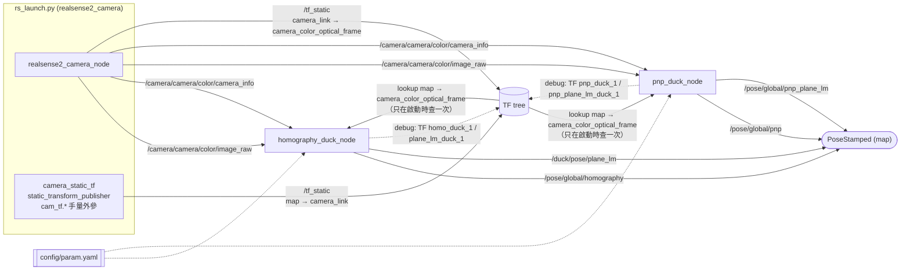
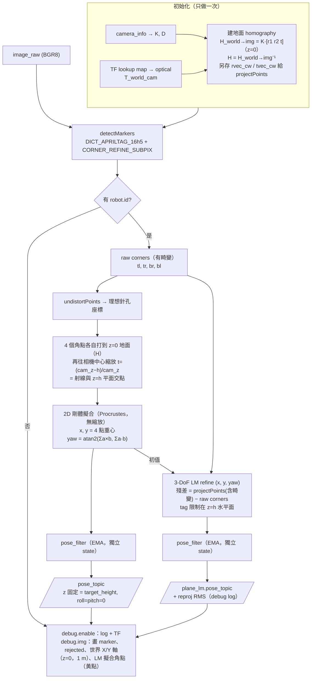
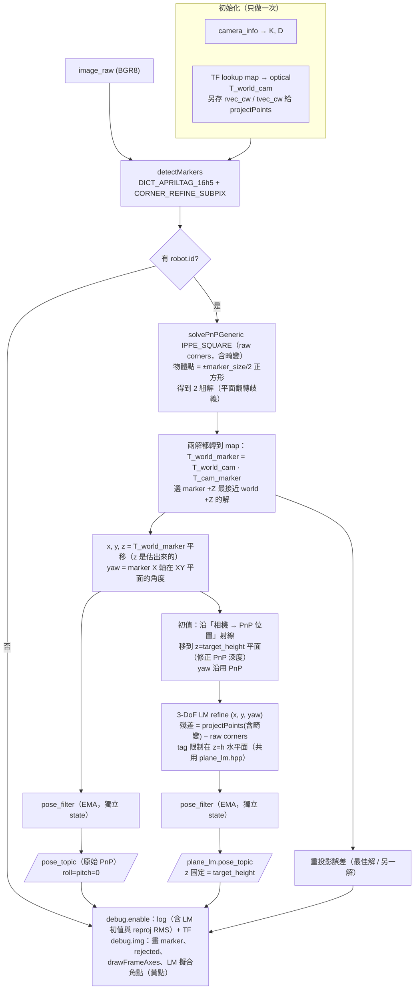
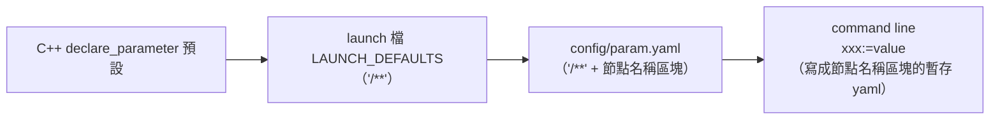

# 定位流程架構

俯瞰相機（RealSense D455）+ 機器人頂部 AprilTag 16h5，兩個定位節點：

| 節點 | 方法 | 輸出 |
|---|---|---|
| `homography_duck_node` | tag 固定在已知高度的水平面上（3 DoF：x, y, yaw） | `/pose/global/homography`（閉式解）、`/duck/pose/plane_lm`（LM refine） |
| `pnp_duck_node` | solvePnP 自由 6 DoF，再轉到 map；再以 PnP 為初值做平面約束 LM | `/pose/global/pnp`（原始 PnP）、`/pose/global/pnp_plane_lm`（LM refine） |

---

## 1. 系統總覽



TF 樹：

```
map ──(cam_tf.*, rs_launch.py)──> camera_link ──(RealSense 出廠)──> camera_color_frame ──> camera_color_optical_frame
 └──(debug)──> homo_duck_1 / plane_lm_duck_1 / pnp_duck_1 / pnp_plane_lm_duck_1
```

---

## 2. homography_duck_node



重點：
- **z 永遠等於 `target_height`**，不是估出來的。
- xy 精度直接受 **`target_height` 和相機外參** 影響。h 誤差會沿相機放射方向造成比例誤差；外參角度誤差會造成整體平移（見第 5 節）。
- 閉式解不需要 marker 邊長（正方形重心就是中心）；LM 需要 `robot.marker_size`。

---

## 3. pnp_duck_node



重點：
- 原始 PnP 的 **z 不固定**，是由 tag 在影像中的大小推出的深度，所以強烈依賴 `robot.marker_size` 準確。
- LM 版本和 `homography_duck` 的 plane_lm 用**同一個目標函數**（`include/aruco_test/plane_lm.hpp`），只差初值來源，因此收斂到同一個解（實測差異 < 0.1 mm）。
- 原始 PnP 的 z 可以當**一致性檢查**：若 z 明顯偏離 `target_height`，代表 `marker_size`、`target_height`、相機高度三者至少有一個不對。

---

## 4. 參數來源與優先順序



右邊蓋左邊。`ros2 run` 不經過 launch，只會有 C++ 預設 + `--ros-args -p`。
相機外參不在 param.yaml，而是 `rs_launch.py` 的 `cam_tf.*` 參數。

---

## 5. 目前已知的誤差來源（2026-09-19 實測）

### 第一次（`cam_tf.z=1.45`、`marker_size=0.1`）

真值 (0.08, 0.05, 0.2)、yaw 0，靜止 30 幀：

| 方法 | xy 誤差 | yaw 誤差 | 抖動 (xy std) |
|---|---:|---:|---:|
| homo（舊版中心點） | 176 mm | −2.85° | 0.15 mm |
| homo4（目前 `/pose/global/homography`） | 176 mm | −1.80° | 0.08 mm |
| plane_lm | 177 mm | −1.69° | 0.09 mm |
| pnp | 331 mm（z=0.073，應為 0.2） | −1.92° | 2.6–3.7 mm |

所有方法偏同一個方向 → 主要是**相機外參（cam_tf）誤差**，不是定位演算法。

### 第二次（`cam_tf.z=1.3`、`marker_size=0.08`，**機器人不在真值位置**：tag 在影像中比真值位置偏右約 15 px，只能用來比較方法間差異）

同一批影像同時跑兩個節點，各 60 幀：

| 輸出 | x | y | z | yaw |
|---|---:|---:|---:|---:|
| pnp（原始） | 0.0306 | 0.0842 | 0.202 | −2.93° |
| pnp_plane_lm | 0.0291 | 0.0823 | 0.200 | −2.72° |
| homography（homo4） | 0.0291 | 0.0823 | 0.200 | −2.81° |
| homography plane_lm | 0.0291 | 0.0823 | 0.200 | −2.72° |

- 原始 PnP 的 z = 0.202，和 `target_height` 一致 → `marker_size=0.08` 與 `cam_tf.z=1.3` 彼此吻合。
- 兩個 plane_lm 結果相同（同一目標函數），homo4 只差 yaw 0.09°。

### 第三次（`cam_tf.z=1.3`、`marker_size=0.08`，真值 (0.08, 0.05, 0.2)、yaw 0，使用中的 `pnp_duck_node`，60 幀）

| 輸出 | x | y | dx (mm) | dy (mm) | xy 誤差 | yaw 誤差 | 抖動 (x / y std) |
|---|---:|---:|---:|---:|---:|---:|---:|
| `/pose/global/pnp` | 0.0503 | 0.0857 | −29.7 | +35.7 | 46 mm | −0.57° | 2.1 / 2.9 mm |
| `/pose/global/pnp_plane_lm` | 0.0533 | 0.0896 | −26.7 | +39.6 | 48 mm | −1.00° | 0.07 / 0.12 mm |

- 兩個輸出的平均位置差不多，plane_lm 把抖動降了約 25–30 倍。
- 剩下約 5 cm 的偏差兩者一致 → 仍是外參（cam_tf）問題。
